# Polibit Investment Platform - Entity Relationship Diagram

## Mermaid ER Diagram

```mermaid
erDiagram
    STRUCTURE ||--o{ INVESTOR : "has many via fundOwnerships"
    STRUCTURE ||--o{ INVESTMENT : "owns"
    STRUCTURE ||--o{ CAPITAL_CALL : "issues"
    STRUCTURE ||--o{ DISTRIBUTION : "executes"
    STRUCTURE ||--o{ WATERFALL_TIER : "defines"
    STRUCTURE ||--o{ STRUCTURE : "parent-child hierarchy"
    STRUCTURE ||--o{ DOCUMENT : "has"

    INVESTOR ||--o{ FUND_OWNERSHIP : "has"
    INVESTOR ||--o{ INVESTMENT_SUBSCRIPTION : "subscribes"
    INVESTOR ||--o{ CAPITAL_CALL_ALLOCATION : "receives"
    INVESTOR ||--o{ DISTRIBUTION_ALLOCATION : "receives"
    INVESTOR ||--o{ DOCUMENT : "has"

    INVESTMENT ||--o{ INVESTMENT_SUBSCRIPTION : "target"
    INVESTMENT ||--o{ DOCUMENT : "has"
    INVESTMENT }o--o| CAPITAL_CALL : "related to"
    INVESTMENT }o--o| DISTRIBUTION : "related to"

    CAPITAL_CALL ||--o{ CAPITAL_CALL_ALLOCATION : "allocates"

    DISTRIBUTION ||--o{ DISTRIBUTION_ALLOCATION : "allocates"
    DISTRIBUTION ||--o{ WATERFALL_BREAKDOWN : "applies"

    USER ||--o{ CAPITAL_CALL : "creates"
    USER ||--o{ DISTRIBUTION : "creates"
    USER ||--o{ DOCUMENT : "uploads"

    API_USER ||--o| KYC_SESSION : "has"

    STRUCTURE {
        uuid id PK
        string name
        string type
        string subtype
        string jurisdiction
        decimal totalCommitment
        string currency
        int investors
        timestamp createdDate
        string status
        date inceptionDate
        string currentStage
        string fundTerm
        string fundType
        decimal minCheckSize
        decimal maxCheckSize
        string economicTermsApplication
        string distributionModel
        string managementFee
        string performanceFee
        string hurdleRate
        string preferredReturn
        string waterfallStructure
        jsonb waterfallScenarios
        string distributionFrequency
        string defaultTaxRate
        string debtInterestRate
        string debtGrossInterestRate
        string plannedInvestments
        string financingStrategy
        string equitySubtype
        string debtSubtype
        string usState
        string capitalCallNoticePeriod
        string capitalCallDefaultPercentage
        string capitalCallPaymentDeadline
        string determinedTier
        int calculatedIssuances
        string tokenName
        string tokenSymbol
        decimal tokenValue
        bigint totalTokens
        int minTokensPerInvestor
        int maxTokensPerInvestor
        jsonb preRegisteredInvestors
        jsonb uploadedFundDocuments
        jsonb uploadedInvestorDocuments
        boolean hierarchyMode
        string hierarchySetupApproach
        int hierarchyLevels
        int numberOfLevels
        jsonb hierarchyStructures
        uuid parentStructureId FK
        decimal parentStructureOwnershipPercentage
        jsonb childStructureIds
        int hierarchyLevel
        jsonb hierarchyPath
        boolean applyWaterfallAtThisLevel
        boolean applyEconomicTermsAtThisLevel
        string waterfallAlgorithm
        string incomeFlowTarget
        string performanceMethodology
        string calculationLevel
        decimal currentNav
        jsonb navHistory
        jsonb legalTerms
    }

    INVESTOR {
        uuid id PK
        string name
        string email UK
        string phone
        string type
        string status
        string entityName
        string entityType
        string contactFirstName
        string contactLastName
        jsonb fundOwnerships
        jsonb customTerms
        decimal currentValue
        decimal unrealizedGain
        decimal totalDistributed
        decimal netCashFlow
        decimal irr
        string taxId
        string k1Status
        date k1DeliveryDate
        jsonb address
        string preferredContactMethod
        timestamp lastContactDate
        text notes
        jsonb documents
        date investorSince
        timestamp createdAt
        timestamp updatedAt
    }

    FUND_OWNERSHIP {
        uuid fundId FK
        string fundName
        decimal commitment
        decimal ownershipPercent
        decimal calledCapital
        decimal uncalledCapital
        int hierarchyLevel
        date investedDate
        string onboardingStatus
        jsonb customTerms
    }

    INVESTMENT {
        uuid id PK
        string name
        string type
        string status
        string sector
        string investmentType
        decimal totalPropertyValue
        decimal totalCompanyValue
        decimal totalProjectValue
        jsonb geography
        jsonb address
        jsonb fundEquityPosition
        jsonb fundDebtPosition
        jsonb externalDebt
        jsonb totalFundPosition
        decimal totalInvestmentSize
        decimal fundCommitment
        decimal ownershipPercentage
        jsonb visibility
        uuid fundId FK
        date acquisitionDate
        date lastValuationDate
        text description
        jsonb documents
        timestamp createdAt
        timestamp updatedAt
    }

    CAPITAL_CALL {
        uuid id PK
        uuid fundId FK
        string fundName
        int callNumber
        decimal totalCallAmount
        string currency
        date callDate
        date dueDate
        int noticePeriodDays
        text purpose
        uuid relatedInvestmentId FK
        string relatedInvestmentName
        string status
        timestamp sentDate
        jsonb investorAllocations
        decimal totalPaidAmount
        decimal totalOutstandingAmount
        string transactionType
        text useOfProceeds
        boolean managementFeeIncluded
        decimal managementFeeAmount
        text coverLetterTemplate
        string noticeDocumentUrl
        uuid createdBy FK
        timestamp createdAt
        timestamp updatedAt
        timestamp cancelledDate
        text cancelledReason
    }

    CAPITAL_CALL_ALLOCATION {
        uuid investorId FK
        string investorName
        string investorType
        int hierarchyLevel
        decimal commitment
        decimal ownershipPercent
        decimal callAmount
        string status
        decimal amountPaid
        decimal amountOutstanding
        timestamp paidDate
        string paymentMethod
        string transactionReference
        text bankDetails
        boolean noticeSent
        timestamp noticeSentDate
        timestamp noticeOpenedDate
        decimal calledCapitalToDate
        decimal uncalledCapital
    }

    DISTRIBUTION {
        uuid id PK
        uuid fundId FK
        string fundName
        int distributionNumber
        decimal totalDistributionAmount
        string currency
        date distributionDate
        date recordDate
        date paymentDate
        string source
        text sourceDescription
        uuid relatedInvestmentId FK
        string relatedInvestmentName
        boolean isReturnOfCapital
        boolean isIncome
        boolean isCapitalGain
        decimal returnOfCapitalAmount
        decimal incomeAmount
        decimal capitalGainAmount
        string status
        timestamp processedDate
        jsonb investorAllocations
        boolean waterfallApplied
        jsonb waterfallBreakdown
        string transactionType
        decimal exitProceedsMultiple
        text coverLetterTemplate
        string noticeDocumentUrl
        uuid createdBy FK
        timestamp createdAt
        timestamp updatedAt
    }

    DISTRIBUTION_ALLOCATION {
        uuid investorId FK
        string investorName
        string investorType
        decimal ownershipPercent
        decimal baseAllocation
        decimal finalAllocation
        decimal returnOfCapitalAmount
        decimal incomeAmount
        decimal capitalGainAmount
        string status
        timestamp processedDate
        string paymentMethod
        string transactionReference
        text bankDetails
        boolean noticeSent
        timestamp noticeSentDate
        decimal taxWithheld
        decimal taxRate
        decimal distributionsToDate
        decimal dpi
    }

    WATERFALL_BREAKDOWN {
        string tier
        decimal amount
        decimal lpAmount
        decimal gpAmount
    }

    INVESTMENT_SUBSCRIPTION {
        uuid id PK
        uuid investmentId FK
        uuid investorId FK
        uuid fundId FK
        decimal requestedAmount
        string currency
        string status
        text approvalReason
        timestamp createdAt
        timestamp submittedAt
        timestamp approvedAt
        timestamp rejectedAt
        text adminNotes
        boolean linkedFundOwnershipCreated
    }

    WATERFALL_TIER {
        uuid id PK
        uuid structureId FK
        string name
        string type
        int order
        decimal hurdleRate
        decimal lpSplit
        decimal gpSplit
        decimal catchUpTo
        boolean isActive
        timestamp createdAt
        timestamp updatedAt
    }

    DOCUMENT {
        uuid id PK
        string name
        string type
        string category
        string entityType
        uuid entityId FK
        string url
        string fileName
        bigint fileSize
        string mimeType
        int version
        uuid previousVersionId FK
        text versionNotes
        jsonb tags
        jsonb metadata
        uuid uploadedBy FK
        timestamp uploadedDate
        timestamp createdAt
        timestamp updatedAt
    }

    USER {
        uuid id PK
        string name
        string email UK
        string role
        string status
        timestamp createdAt
        timestamp lastLogin
        uuid invitedBy FK
        string profileImage
    }

    API_USER {
        uuid id PK
        string email UK
        string firstName
        string lastName
        string appLanguage
        string profileImage
        int role
        timestamp lastLogin
        uuid kycId FK
        string kycStatus
        string kycUrl
        string address
        string country
        timestamp createdAt
        timestamp updatedAt
    }

    KYC_SESSION {
        uuid id PK
        uuid userId FK
        string sessionId UK
        string provider
        string status
        jsonb verificationData
        string pdfUrl
        timestamp createdAt
        timestamp completedAt
        timestamp expiresAt
    }

    PAYMENT {
        uuid id PK
        uuid userId FK
        uuid structureId FK
        uuid submissionId FK
        string email
        decimal amount
        string currency
        string paymentMethod
        string status
        string fileUrl
        string fileName
        text notes
        timestamp createdAt
        timestamp processedAt
    }

    FIRM_SETTINGS {
        uuid id PK
        string firmName
        string firmLogo
        text firmDescription
        string firmWebsite
        text firmAddress
        string firmPhone
        string firmEmail
        timestamp updatedAt
    }

    NOTIFICATION_SETTINGS {
        uuid id PK
        uuid userId FK
        jsonb capitalCallIssued
        jsonb distributionExecuted
        jsonb paymentOverdue
        jsonb paymentReceived
        jsonb reportGenerated
        jsonb quarterlyReportDue
        jsonb newInvestorAdded
        jsonb investorDocumentUploaded
        jsonb systemMaintenance
        jsonb securityAlert
        string emailAddress
        boolean enableEmailNotifications
        boolean enableInAppNotifications
        timestamp updatedAt
    }
```

## Legend

- **PK**: Primary Key
- **FK**: Foreign Key
- **UK**: Unique Key
- **||--o{**: One-to-Many Relationship
- **}o--o|**: Many-to-One Optional Relationship
- **||--||**: One-to-One Relationship

## Relationship Types

### One-to-Many Relationships
1. Structure → Investor (via fundOwnerships array)
2. Structure → Investment
3. Structure → Capital Call
4. Structure → Distribution
5. Structure → Waterfall Tier
6. Structure → Document
7. Investor → Fund Ownership (embedded)
8. Investor → Investment Subscription
9. Investor → Document
10. Investment → Investment Subscription
11. Investment → Document
12. Capital Call → Capital Call Allocation (embedded)
13. Distribution → Distribution Allocation (embedded)
14. User → Capital Call
15. User → Distribution
16. User → Document

### Self-Referential Relationships
1. Structure → Structure (hierarchical parent-child)

### Many-to-Many Relationships
1. Investor ↔ Structure (via fundOwnerships array in Investor table)

### Optional Relationships
1. Investment → Capital Call (relatedInvestmentId)
2. Investment → Distribution (relatedInvestmentId)

## Notes

- JSONB fields are used for flexible nested data structures (PostgreSQL)
- Embedded arrays (investorAllocations, fundOwnerships) can be normalized into separate tables for better query performance
- All timestamps use ISO 8601 format
- All monetary values use DECIMAL for precision
- UUIDs are used as primary keys for distributed systems compatibility
